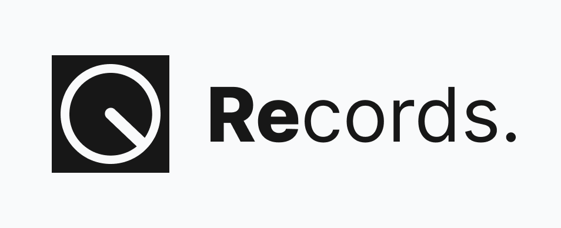
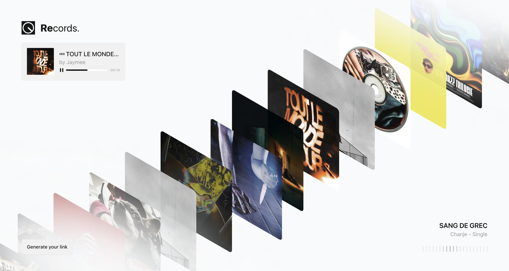

> 3D Visualizer for your Spotify's monthly top tracks.

    

---

## How to make it run locally

### 0 ‣ Pre-requisites

- [Node.js](https://nodejs.org/en/download/)
- [Spotify Developer Account](https://developer.spotify.com/dashboard/applications)
- Clone this repository

---

### 1 ‣ Create a Spotify App

First of all, you need to create a Spotify App in the [Spotify Developer Dashboard](https://developer.spotify.com/dashboard/applications).

- Click on `Create an App`
- Choose the name/description you want
- Add `http://localhost:3000/api/callback` to the Redirect URIs & select `Web API` for the API you're planning to use.

Once you've created the app, you'll get a `Client ID` and a `Client Secret` (you can find it on your app settings). You'll need these in the next step.

---

### 2 ‣ Set up the main environment variables

Create a `.env` file in the root of the project and add the following variables:

```bash
# Spotify API
SPOTIFY_CLIENT_ID="YOUR_SPOTIFY_CLIENT_ID"
SPOTIFY_CLIENT_SECRET="YOUR_SPOTIFY_CLIENT_SECRET"

# App URLs
REDIRECT_URI="http://localhost:3000/api/callback"
NEXT_PUBLIC_BASE_URL="http://localhost:3000"
```

---

### 3 ‣ Run the project

This app was built with Next.js, so you can run it with the following commands:

```bash
# Install dependencies
npm install

# Run the project
npm run dev
```

- The project should now be running on `http://localhost:3000`

You can now login with your Spotify account or any account added to your app in the Spotify Developer Dashboard and visualize your top tracks.



PS : Don't mind the `Request access` part, it is not useful in your case. Also, you can't create a share link as it requires a MongoDB database to store the user's data.

---

### Bonus ‣ MongoDB

To store the user's data and create a share link, I'm using a MongoDB database. So if you want to implement this feature, you'll need to create your own MongoDB database and add the following variables to your `.env` file:

```bash
# MongoDB
MONGODB_URI="YOUR_MONGODB_URI"
```

---

Thanks for reading ! If you have any questions, feel free to ask me on [X](https://x.com/colindmg).

✦ ✶ ✷
